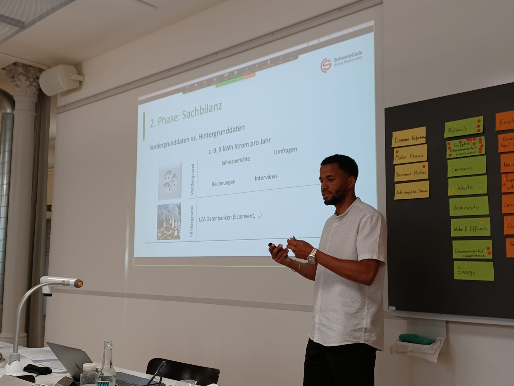

+++
title = 'Transition'
date = 2023-01-01T08:00:00-07:00
draft = false
+++

Le bureau de conseil **Transition** accompagne les acteurs et actrices des domaines privés et publiques dans leurs démarches pour une société plus durable. Les conseils sont basés sur des modélisations qui permettent de prendre des décisions fondées, concrètes et rationnelles.

L'offre de services est transparente, sincère et respectueuse des attentes. Les conseils sont basés sur une approche collaborative et la modélisation du sujet de l’étude par le biais de l’analyse de cycle de vie (ACV), une méthode scientifique permettant une analyse quantitative des impacts sur l’environnements d’un produit, d’un service, d’un évènement, d’une entreprise, etc.

Les valeurs de Transition sont l’**efficacité**, l’**humanisme**, l’**honnêteté** et la **rigueur scientifique**.

## Léonard Marchand
Formé à l’Ecole polytechnique fédérale de Zürich (ETHZ), Léonard Marchand est ingénieur en environnement spécialisé dans la conception écologique de systèmes (Ecological System Design) et dans l’analyse de cycles de vie. Il évolue depuis plusieurs années dans le domaine du conseil et a pu ainsi acquérir une grande expérience et perfectionner son approche des défis environnementaux. De langue maternelle française, Léonard Marchand parle couramment l’allemand et l’anglais.

