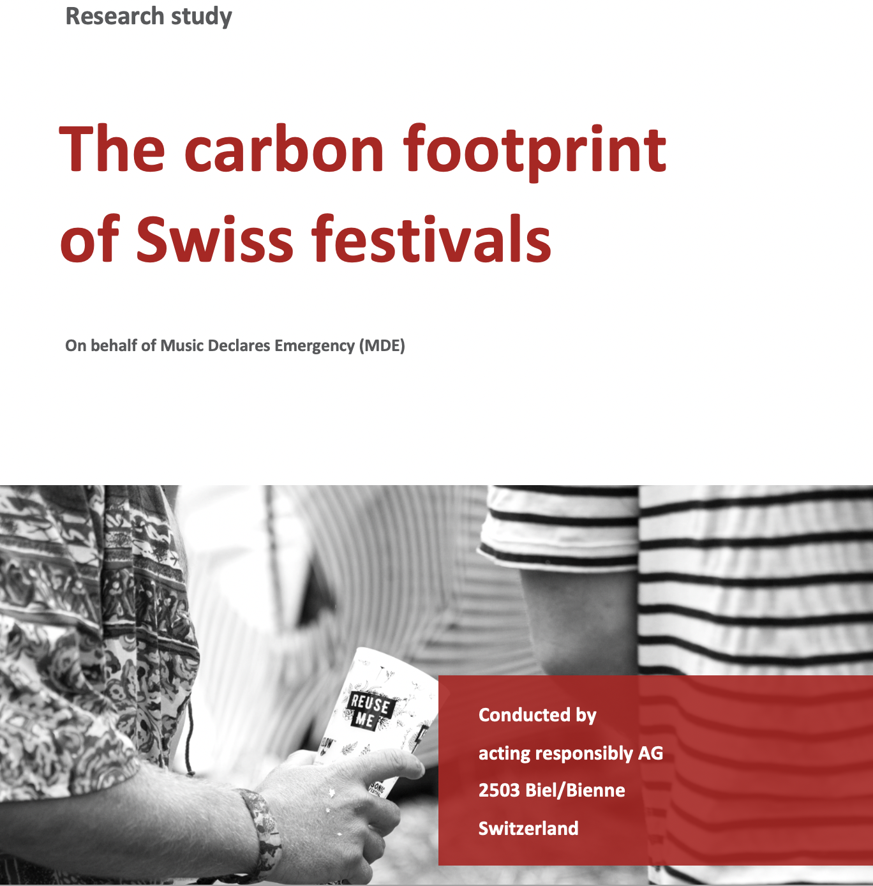

+++
title = '2023 / Musikfestivals'
summary = 'In Zusammenarbeit mit Acting Responsibly hat das Beratungsbüro Transition ein Model entwickelt, um die Emissionen von CO2-Äquivalenten der Festivals über ein Jahr zu quantifizieren.'
date = 2023-01-01T08:00:00-07:00
draft = false
weight = 10
+++

Der Verein Music Declares Emergency (MDE) hat im Jahr 2022 eine Studie über den Fussabdruck der Schweizer Musikfestivals beauftragt. In Zusammenarbeit mit Acting Responsibly hat das Beratungsbüro Transition ein Model entwickelt, um die Emissionen von CO2-Äquivalenten der Festivals über ein Jahr (Referenzjahr 2022) zu quantifizieren. Die Ergebnisse der Studie wurden im März 2023 am Festival M4Music in Zürich gezeigt. Parallel zur Studie wurde ein Dokumentarfilm von Daniela Weinmann und Céline Werdelis gedreht.  

Die Studie liefert erste Erkenntnisse zur Zusammensetzung des Fussabdruckes der Musikevents in der Schweiz und ermöglicht zukünftigen Untersuchungen, den Fokus auf die wichtigsten Prozesse zu setzen.
