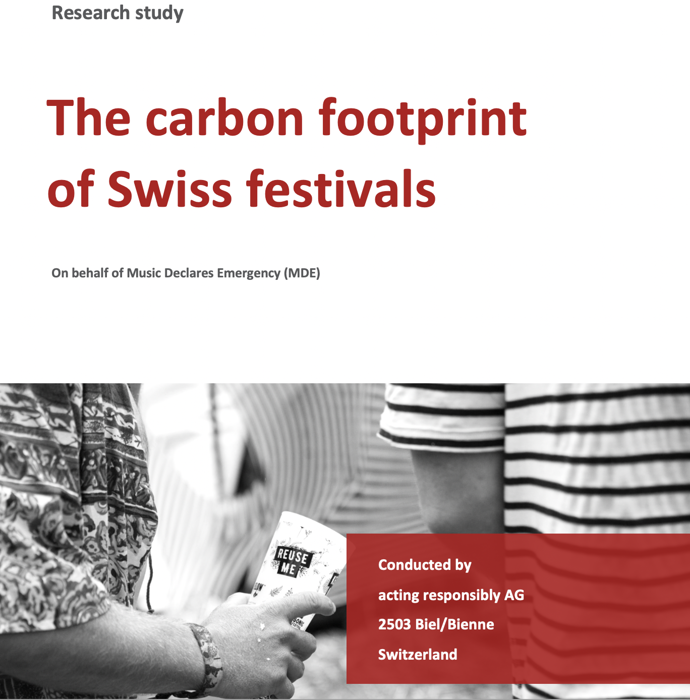

+++
title = 'Swiss Festivals'
summary = 'En 2022, Transition a élaboré un modèle pour le calcul des émissions de CO2-équivalents des festivals de musique en Suisse.'
date = 2023-01-01T08:00:00-07:00
draft = false
weight = 10
+++

L'association Music Declares Emergency (MDE) a mandaté en 2022 une étude sur l'impact carbone des festivals de musique en Suisse. En collaboration avec Acting Responsibly, le bureau de conseils Transition a réalisé le modèle de calcul des émissions de CO2-équivalents émises par les festivals de musique en Suisse sur une année (année de référence 2022). Les résultats de l'étude on été présentés au festival M4Music en mars 2023 à Zürich. En parallèle de l'étude,un documentaire a été réalisé par Daniela Weinmann et Céline Werdelis.  

Cette étude donne de prmière indications sur la provenance des émissions dans le cadre des festivals de musique en Suisse et permet aux recherches futures de mettre la priorité sur les activités qui contribuent le plus au réchauffement climatique.